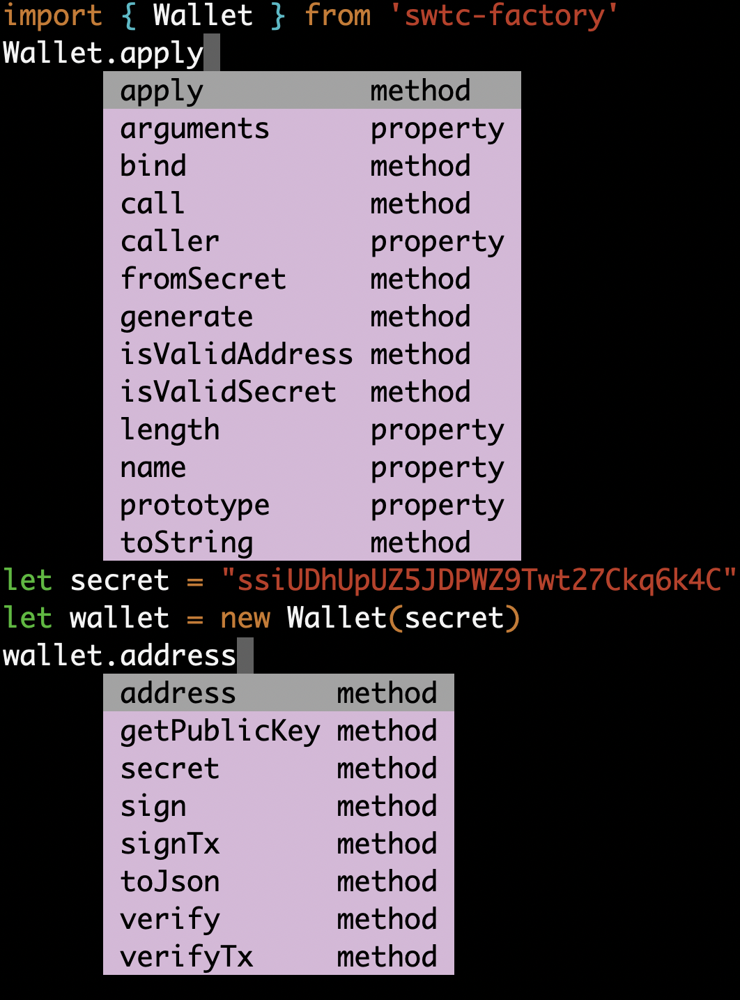
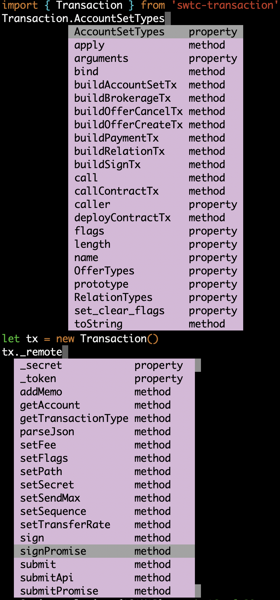
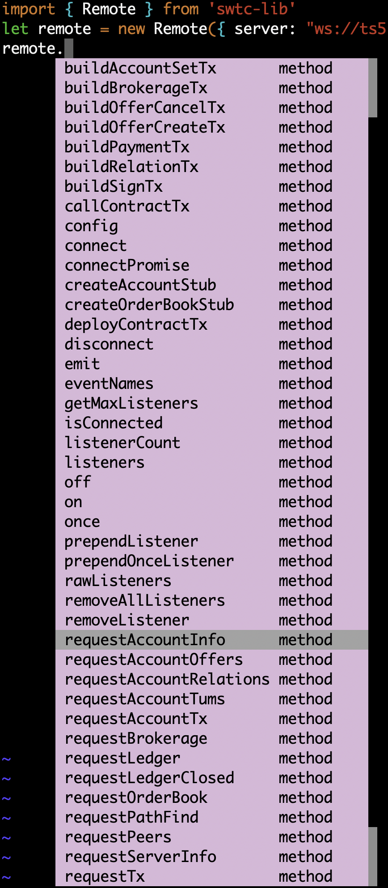
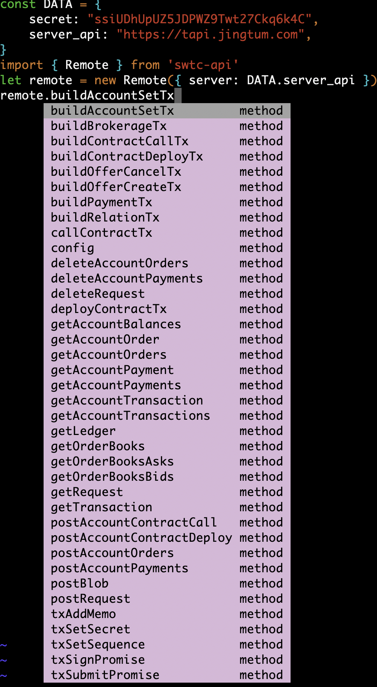

# swtc-lib增强

## [应用实例](../)

## 目录
> ### 强兼容
> ### 现代性
> ### class实现
> ### typescript实现
> ### 格式化代码
> ### 按照功能分发包
> ### travis集成
> ### 完善测试

## 内容
### 扩展
  - 实现了ApiRemote(swtc-api)
  - 默认使用 https://api.jingtum.com
### 安全
  - 本地签名
  - 密钥不出本机
### 强兼容
  - 所有包确保零配置webpack和browserify兼容
  - 可以用于网络应用 桌面应用 终端应用 移动应用
### 现代性
  - 原生Promise支持
  - Remote.connectPromise()
  - Request.submitPromise()
  - Transaction.signPromise()
  - Transaction.submitPromise()
  - ApiRemote.allmethods()
### class实现
  - ApiRemote
  - Server
  - Remote
  - Request
  - Transaction
    - 签名实现
	- 提交实现
  - Wallet (swtc-factory)
    - 支持swtc bitcoin ripple bwt call stm
### typescript实现
  - 编辑器帮助提示
  - ApiRemote
  - Server
  - Remote
  - Request
  - Transaction
  - Wallet
### 格式化代码
  - prettier格式化
  - eslint / tslint
### 按照功能分发包
```bash
$ npm list | grep swtc
└─┬ swtc-lib@1.6.10
  ├─┬ swtc-transaction@1.1.5
  │ ├─┬ swtc-serializer@2.0.8
  │ │ ├─┬ swtc-factory@1.2.1
  │ │ │ └─┬ swtc-keypairs@0.11.15
  │ │ │   └─┬ swtc-address-codec@2.0.7
  │ │ │     ├── swtc-chains@1.0.4
  │ │ └─┬ swtc-utils@1.0.3
  | │   ├── swtc-factory@1.2.1 deduped
└─┬ swtc-api@1.0.5
  └─┬ swtc-transaction@1.1.5
    ├─┬ swtc-serializer@2.0.8
    │ ├─┬ swtc-factory@1.2.1
    │ │ └─┬ swtc-keypairs@0.11.15
    │ │   └─┬ swtc-address-codec@2.0.7
    │ │     ├── swtc-chains@1.0.4
    │ └─┬ swtc-utils@1.0.3
    │   ├── swtc-factory@1.2.1 deduped
```
### travis集成
  - 代码提交自动测试
### 完善测试
  - 添加新功能测试

## 方法汇总
### Wallet

### Transaction

### Remote

### ApiRemote

